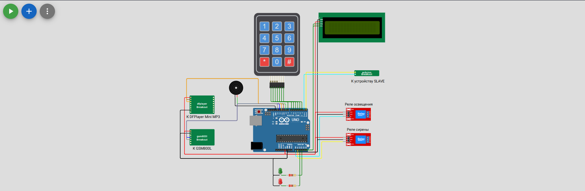
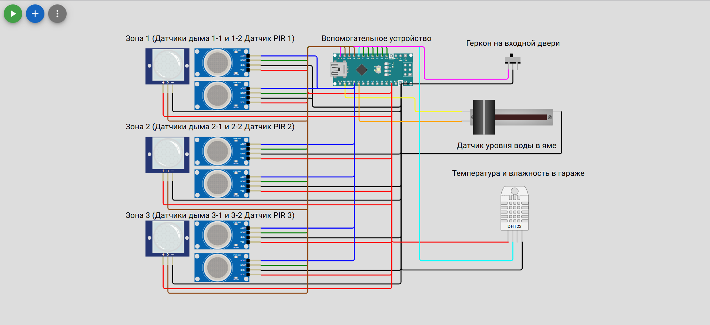

# Guardian - Пожарно-охранная система на Arduino

## Описание

Система Guardian – это пожарно-охранная система на базе Arduino, предназначенная для мониторинга состояния помещения и оповещения о возникновении нештатных ситуаций, таких как:

*   Открытие двери
*   Обнаружение движения
*   Задымление
*   Превышение уровня воды
*   Изменение температуры и влажности

## Функциональность

*   Поддержка до 3 зон (помещений)
*   Контроль открытия двери (геркон)
*   Обнаружение движения (PIR-датчики)
*   Обнаружение задымления (датчики дыма)
*   Контроль уровня воды (датчик уровня воды)
*   Мониторинг температуры и влажности (DHT22)
*   Постановка/снятие с охраны с помощью keypad
*   SMS-оповещения через GSM-модуль
*   Звуковые оповещения через DFPlayer Mini
*   Световая индикация режимов работы (светодиоды)
*   Управление реле (сирена, свет)
*   Настройка параметров через Serial Monitor

#### Система состоит из двух Arduino:

*  **Основная Arduino**: 
   Обрабатывает данные с вспомогательной Arduino, управляет логикой работы системы (постановка/снятие с охраны, сирена, реле), взаимодействует с пользователем через LCD-дисплей и keypad, отправляет SMS-оповещения через GSM-модуль и воспроизводит звуковые оповещения через DFPlayer Mini.

*  **Вспомогательная Arduino**: Собирает данные с датчиков (геркон, датчики дыма, датчики движения, датчик температуры и влажности DHT22, датчик уровня воды) и передает их на основную Arduino по последовательному порту.

## Схема подключения

### Основная Arduino
    
    +-------------------------+---------------------+
    | Компонент               | Пин Arduino         |
    +-------------------------+---------------------+
    | LCD-дисплей (SDA)       | A4                  |
    | LCD-дисплей (SCL)       | A5                  |
    | Keypad                  | 2, 3, 4, 5, 6, 7, 8 |
    | Реле света              | A0                  |
    | Реле сирены             | A1                  |
    | Красный светодиод       | A2                  |
    | Зеленый светодиод       | A3                  |
    | Буззер                  | 9                   |
    | DFPlayer Mini (RX)      | 11                  |
    | DFPlayer Mini (TX)      | 10                  |
    | GSM-модуль (RX)         | 13                  |
    | GSM-модуль (TX)         | 12                  |
    | Serial (Вспом. Arduino) | (RX, TX)            |
    +-------------------------+---------------------+

### Вспомогательная Arduino

    +---------------------------------------+-----------------------+
    | Компонент                             | Пин Arduino           |
    +---------------------------------------+-----------------------+
    | Датчик температуры/влажности (DHT22)  | 8                     |
    | Датчики дыма                          | A0 + 2, 3, 4, 5, 6, 7 |
    | Датчики движения (PIR)                | 9, 10, 11             |
    | Геркон                                | 12                    |
    | Датчик уровня воды                    | A1                    |
    | Serial (Основ. Arduino)               | (RX, TX)              |
    +---------------------------------------+-----------------------+

#### Протоколы и взаимодействие

1. **I2C**: Используется для связи основной Arduino с LCD-дисплеем. Адрес дисплея по умолчанию – 0x27.

2. **Последовательный порт (Serial)**:

   * Основная Arduino принимает данные от вспомогательной Arduino в следующем формате (Hex String):

            FF[GerconState][Sensor1][Sensor2][Sensor3][Sensor4][Sensor5][Sensor6][Motion1][Motion2][Motion3][TemperatureSign][Temperature][Humidity][WaterLevel]FF

      * FF: Start and End Byte
      * GerconState: 01 - дверь открыта, 00 - дверь закрыта
      * Sensor1-6: 01 - задымление, 00 - норма
      * Motion1-3: 01 - движение, 00 - нет движения
      * TemperatureSign: 00 - отрицательная температура, 01 - положительная температура
      * Temperature: Температура в градусах Цельсия (Hex)
      * Humidity: Влажность в процентах (Hex)
      * WaterLevel: 01 - высокий уровень воды, 00 - норма
      
        Примеры пакетов от вспомогательной Arduino:

      * `FF00000000000000000000010d4000FF` - Дверь закрыта. Дыма нет. Движения нет. Не затапливает. Температура 13.0°C. Влажность 64.5%.
      * `FF00000000000000000100010d4000FF` - Дверь закрыта. Дыма нет. Сработал датчик движения. Не затапливает. Температура 13.0°C. Влажность 64.5%.
      * `FF00000100000000000000010d4000FF` - Дверь закрыта. Сработал 1 датчик дыма. Движения нет. Не затапливает. Температура 13.0°C. Влажность 64.5%.
      * `FF00010100000000000000010d4000FF` - Дверь закрыта. Сработали 2 датчика дыма. Движения нет. Не затапливает. Температура 13.0°C. Влажность 64.5%.
      * `FF01000000000000000000010d4000FF` - Дверь открыта. Дыма нет. Движения нет. Не затапливает. Температура 13.0°C. Влажность 64.5%.
      * `FF00000000000000000000010d4001FF` - Дверь закрыта. Дыма нет. Движения нет. Затапливает. Температура 13.0°C. Влажность 64.5%.

    * Основная Arduino отправляет команды конфигурации на основную Arduino в формате:

    	* SET[variable]=[value] - установить значение переменной
    	* GET[variable] - получить значение переменной

3. **GSM (Serial)**: Основная Arduino использует AT-команды для отправки SMS-оповещений через GSM-модуль.
4. **DFPlayer Mini (Serial)**: Основная Arduino использует библиотеку `DFPlayer_Mini_Mp3.h` для воспроизведения звуковых оповещений.

#### Конфигурация

Параметры системы хранятся в EEPROM основной Arduino. Их можно изменить через Serial Monitor, отправляя команды `SET`.

   * `secretCode`: Код для снятия/постановки на охрану (4 цифры). По умолчанию "0000".
   * `phoneOperator`: Номер телефона оператора для отправки SMS (11 цифр). По умолчанию "89000000000".
   * `delay_lock`: Задержка перед постановкой на охрану (мс). По умолчанию 2500.
   * `delay_unlock`: Задержка перед снятием с охраны (мс). По умолчанию 500.
   * `delay_pass`: Задержка после ввода неверного пароля (мс). По умолчанию 1000.
   * `pass_timeout`: Время ожидания ввода пароля после открытия двери (мс). По умолчанию 30000.
   * `delay_siren`: Время работы сирены (мс). По умолчанию 30000.

Пример:

   * `SET secretCode=1234`
   * `SET phoneOperator=89123456789`
   * `GET info` - выводит текущие настройки в Serial Monitor
   * ~~`GET eeprom` - выводит дамп EEPROM в Serial Monitor~~

#### Логика работы

1. **Постановка на охрану**:
	* Пользователь нажимает кнопку # на клавиатуре.
	* Воспроизводится звуковое оповещение "Взятие под охрану. Покиньте объект!".
	* Моргает зеленый светодиод.
	* Идёт обратный отсчет **delay_lock**.
	* По окончанию **delay_lock** гаснет свет и подсветка на дисплее.
	* Воспроизводится звуковое оповещение "Объект установлен под охрану!".
	* Загорается красный светодиод.
	* Прибор переходит в режим охраны.
2. **Снятие с охраны**:
	* Пользователь открывает дверь (срабатывает геркон).
	* Включается свет и подсветка на дисплее.
	* Воспроизводится звуковое оповещение "Внимание! Дверь открыта. Введите пароль!".
	* Идёт обратный отсчет **pass_timeout**.
	* Если код верен, система снимается с охраны через **delay_unlock**.
		* Включается зеленый светодиод, выключается красный.
		* Воспроизводится звуковое оповещение "Внимание! Объект снят с охраны!".
	* Если код верен неправильный:
		* Продолжается отсчет **pass_timeout**.
		* Воспроизводится звуковое оповещение "Неправильный пароль! Повторите попытку!".
		* Идёт обратный отсчет **delay_pass**.
	* Если истекло время ввода правильного пароля:
		* Выключается свет и посветка на дисплее.
		* Воспроизводится звуковое оповещение "Тревога! Проникновение на объект!".
		* Включается сирена.
		* Идёт отправка SMS о событии.
3. **Тревога**:
	* При срабатывании датчиков (движение, задымление, превышение уровня воды) система отправляет SMS-оповещение на номер телефона оператора.
	* Включается сирена.
	* Воспроизводится соответствующее звуковое оповещение.
4. **Изменение код**а:
	* В режиме снятия с охраны пользователь нажимает кнопку "*".
	* Система предлагает ввести новый код и подтвердить его.
	* Если коды совпадают, новый код сохраняется в EEPROM.

#### Необходимые библиотеки

* Wire.h
* LiquidCrystal_I2C.h
* Keypad.h
* EEPROM.h
* SoftwareSerial.h
* DFPlayer_Mini_Mp3.h
* dht.h

#### Голосовое уведомление

Файлы Mp3 необходимо поместить в папку mp3 на sd карте в DFPlayer Mini. Библиотека *DFPlayer Mini Mp3* будет автоматически вызывать и проигрывать нужный трек при событиях.

#### Компоненты

* Прибор

    * Arduino UNO
	* Arduino Nano
	* Плата расширения IO Shield для Arduino Nano
	* Корпус пластиковый 120х100х40 мм для конструирования РЭА
	* Источник бесперебойного питания 12 В-2 А
	* Дисплей LCD1602C с I2C
	* [Накладка на дисплей](Models/Display_panel.stl)
	* Матричная клавиатура 3х4 механическая
	* Зуммер
	* Светодиодный модуль 0.23 Вт, Красный/Зелёный 
	* Модуль реле Ардуино, 2 канала, 220В 10А
	* Динамик YD103-71 6W 8ohm
	* Аудио модуль (MP3-плеер) DFPlayer mini
	* Модуль GPRS GSM SIM800l + антена

* Датчики и комплектующие

    * Датчик широкого спектра газов MQ-2 Arduino (6 ШТ)
	* [Корпус (низ) для MQ-2](Models/MQ2-Bottom-02.stl)
	* [Корпус (верх) для MQ-2](Models/MQ2-Top-02.stl)
    * Инфракрасный датчик движения HC-SR501 для Arduino (3 ШТ)
	* [Корпус для HC-SR501](Models/PIR45_angular.stl)
	* Проводной магнитоконтактный датчик (геркон) двери (1 ШТ)
	* Датчик уровня воды Ардуино (1 ШТ)
	* Цифровой датчик температуры и влажности DHT22 (AM2302) (1 ШТ)
	* Проводная свето-звуковая сирена к охранной сигнализации
	* Светодиодный модуль 0.23 Вт, Красный/Зелёный 

#### Информация

Попробовать в эмуляторе можно по ссылкам:

[Головное устройство](https://wokwi.com/projects/432747694750118913)
[Вспомогательное устройство](https://wokwi.com/projects/432639970081871873)

## Автор

[Антон Виноградов](https://t.me/vinantole)
